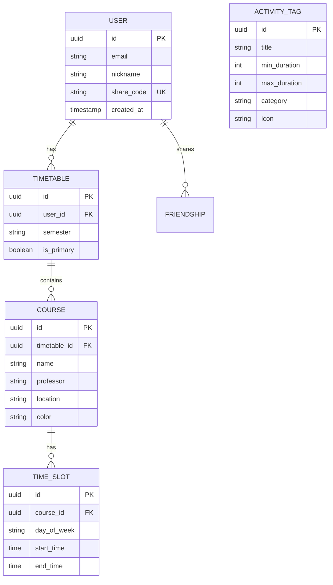

# [PRD] 공강 시간 활용 및 친구 매칭 웹 서비스: 「공강요정 (GongGang Mate)」

---

## 1. 프로젝트 개요 (Overview)

- **프로젝트 명**: **공강요정 (GongGang Mate)** (가칭)
- **한 줄 정의**: 대학생의 비어있는 시간(공강)을 자동으로 분석하여 최적의 할 일을 추천하고, 친구와의 겹치는 공강을 매칭해주는 올인원 시간표 라이프스타일 웹 앱
- **타겟 사용자**:
  - 수업 사이 애매한 공강 시간(30분~2시간)을 무의미하게 스마트폰만 보며 흘려보내는 대학생
  - 공강 시간에 밥을 먹거나 카공(카페 공부)할 친구를 매번 메신저로 시간표를 대조하며 찾기 번거로운 학생
  - 불규칙한 시간표 속에서 자투리 시간을 활용해 과제, 운동, 휴식을 계획적으로 챙기고 싶은 학생

---

## 2. 문제 정의 및 목표 (Problem & Goals)

### 2.1 해결하려는 문제 (Problem Statement)
1. **자투리 시간의 비효율적 낭비**:
   - 30분, 1시간, 2시간 등 들쭉날쭉한 공강 시간에 무엇을 할지 고민하다가 결국 SNS/유튜브만 보며 시간을 버림.
   - 이동 시간이나 준비 시간을 고려했을 때 현실적으로 무엇을 할 수 있는지 직관적으로 파악하기 어려움.
2. **친구와의 약속 조율 피로도**:
   - "너 오늘 공강 언제야?", "나 1시부터 3시까지 비는데 너는?" 등 메신저로 캡처된 시간표 사진을 서로 비교하며 일정을 맞추는 과정이 매우 비효율적임.
3. **시간표 입력의 번거로움**:
   - 매 학기 시간표를 하나하나 수기로 입력하는 것이 귀찮아서 시간표 서비스 연동이나 간편 입력이 필수적임.

### 2.2 서비스 목표 (Success Metrics & Goals)
- **사용자 편의성**: 시간표 등록 후 **클릭 0회**로 당일/주간 공강 시간 자동 시각화
- **행동 유도율**: 제안된 할 일 카드 클릭 또는 완료 체크율 40% 이상
- **소셜 바이럴**: 시간표 공유 링크(URL/코드)를 통한 친구 초대 및 공강 매칭 전환율 50% 이상

---

## 3. 핵심 페르소나 (User Persona)

| 구분 | 페르소나 A (계획파/자투리 활용형) | 페르소나 B (소셜/친목형) |
| :--- | :--- | :--- |
| **이름/나이** | 김민우 (21세, 대학교 2학년) | 이서연 (23세, 대학교 4학년) |
| **상황** | 화/목에 30분 1개, 2시간 공강 1개 발생 | 월/수/금에 점심시간 포함 1시간 반 공강 |
| **Pain Point** | "30분은 도서관 가긴 애매하고, 2시간은 기숙사 가기엔 걷는 시간이 아까워요." | "혼밥하기 싫은데 누구한테 물어봐야 할지 시간표 물어보기 눈치보여요." |
| **Needs** | 공강 길이에 딱 맞는 맞춤 활동 추천 (할 일 큐레이션) | 겹치는 시간에 공강인 친구 목록 및 추천 밥약 장소 확인 |

---

## 4. 주요 기능 명세 (Feature Requirements)

### F-1. 시간표 등록 및 공강 시간 자동 분석 (Core Engine)
- **시간표 입력 방식**:
  1. **수동 입력 (인터랙티브 그리드)**: 요일/시간 블록을 드래그하거나 클릭하여 수업 등록 (수업명, 장소, 요일, 시작/종료 시간).
  2. **에브리타임(Everytime) / iCal 연동 or 이미지/텍스트 파싱**:
     - 1단계 MVP: 요일/교시별 간편 클릭 또는 ICS/JSON 텍스트 붙여넣기.
     - 2단계 고도화: 시간표 이미지 OCR 또는 에브리타임 URL 공유 파싱.
- **공강(Gap) 자동 연산 알고리즘**:
  - 첫 수업 시작 전 / 마지막 수업 종료 후를 제외한 **수업과 수업 사이의 빈 구간(True Gap)** 식별.
  - 옵션: 점심시간(12:00~13:00) 포함 여부 토글 설정 가능.
  - 요일별 공강 리스트 (예: 월요일 11:45 ~ 13:00 [75분], 14:15 ~ 15:00 [45분])와 총 공강 시간 표시.

### F-2. 공강 길이 기반 맞춤형 활동 제안 (Activity Recommender)
- **시간대별 카테고리화**:
  - **⚡ 30분 미만 (마이크로 공강)**:
    - *할 일*: 다음 강의실 미리 이동하기, 테이크아웃 커피 사기, 숏 스트레칭, 영단어 암기, 인스타/휴식
  - **☕ 30분 ~ 1시간 (숏 공강)**:
    - *할 일*: 학생식당 간단 식사, 단과대 라운지 휴식, 밀린 톡/공지 확인, 읽고 싶던 아티클 1편 읽기
  - **📚 1시간 ~ 2시간 (미들 공강)**:
    - *할 일*: 도서관 열람실 과제/복습, 교내 헬스장 운동, 근처 카페 방문, 파워 낮잠(20분) + 정리
  - **🎬 2시간 이상 (우주 공강)**:
    - *할 일*: 교외 맛집 탐방, 영화 관람, 긴 호흡의 팀플 과제, 낮잠, 주변 번화가 산책/쇼핑
- **개인화 필터 & 추천**:
  - 모드 선택: `[공부/과제]` `[휴식/충전]` `[식사/카페]` `[운동/활동]`
  - 체크리스트(To-Do) 연동: 사용자가 등록해둔 개인 할 일을 공강 길이에 맞춰 자동 슬롯팅(Auto-scheduling).

### F-3. 친구 시간표 공유 및 공강 매칭 (Social Gap Matching)
- **고유 공유 코드 및 링크 생성**:
  - 로그인 없이도 생성 가능한 읽기/매칭 전용 단축 링크 (`/share/:shareToken`).
- **친구 공강 겹침 연산 (Overlap Calculation)**:
  - 내 공강 구간과 친구의 공강 구간의 **교집합(Intersection)** 자동 계산.
  - 예: 나(12:00~14:00) ∩ 친구(12:30~15:00) = **겹치는 공강 12:30~14:00 (1시간 30분)**
- **매칭 결과 UI**:
  - "오늘 같이 밥 먹을 수 있는 친구: 민수(12:30~), 지은(13:00~)"
  - "이번 주 가장 긴 공강 데이트 요일: 목요일 2시간"
  - 친구와의 그룹 시간표 뷰어 (오버레이 타임테이블).

### F-4. 통계 및 주간 리포트 (Life Logging)
- "이번 주 나의 총 공강 시간은 8시간 30분입니다!"
- "가장 알차게 보낸 활동: 도서관 과제 (4시간)"

---

## 5. 기술 스택 및 아키텍처 방향 (Tech Stack & Architecture)

### 5.1 기술 스택 제안 (Frontend-First to Fullstack)
빠른 MVP 프로토타이핑과 높은 완성도를 위해 모던 웹 생태계를 권장합니다.

| 레이어 | 기술 스택 | 선정 이유 |
| :--- | :--- | :--- |
| **Frontend** | **React + Vite** (or Next.js) + **Tailwind CSS** + **Lucide React** | 컴포넌트 기반 빠른 UI 구현, 모바일 웹 반응형 최적화, 높은 개발 생산성 |
| **상태 관리** | **Zustand** + **localStorage** (PWA 지원) | 서버 없이도 로컬에서 완전하게 동작하는 MVP 구현 가능 (오프라인 퍼스트) |
| **Backend (선택)** | **Supabase** or **Firebase Firestore** / **Node.js (Fastify)** | 친구 공유용 시간표 동기화, RLS(Row Level Security)를 통한 안전한 링크 공유 |
| **배포/호스팅** | **Vercel** or **Cloudflare Pages** | 즉시 배포 가능, 빠른 글로벌 CDN, 도메인 연결 용이 |

### 5.2 핵심 알고리즘 설계

#### (1) 공강 시간(Gap) 계산 알고리즘
```typescript
interface TimeBlock {
  day: 'MON' | 'TUE' | 'WED' | 'THU' | 'FRI';
  start: number; // 분 단위 (예: 09:00 -> 540)
  end: number;   // 분 단위 (예: 10:15 -> 615)
  title: string;
}

interface GapBlock {
  day: string;
  start: number;
  end: number;
  durationMinutes: number;
  prevClass?: string;
  nextClass?: string;
}

// 공강 추출 로직:
// 1. 특정 요일의 수업들을 start 시간 기준 오름차순 정렬
// 2. 앞 수업의 end와 뒷 수업의 start 사이 차이가 > 0 인 구간 추출
function calculateDailyGaps(classes: TimeBlock[]): GapBlock[] {
  const sorted = [...classes].sort((a, b) => a.start - b.start);
  const gaps: GapBlock[] = [];

  for (let i = 0; i < sorted.length - 1; i++) {
    const currentEnd = sorted[i].end;
    const nextStart = sorted[i + 1].start;

    if (nextStart > currentEnd) {
      gaps.push({
        day: sorted[i].day,
        start: currentEnd,
        end: nextStart,
        durationMinutes: nextStart - currentEnd,
        prevClass: sorted[i].title,
        nextClass: sorted[i + 1].title,
      });
    }
  }
  return gaps;
}
```

#### (2) 친구 공강 교집합(Overlap) 알고리즘
```typescript
// 두 사용자의 공강 구간 중 겹치는 인터벌 계산
function findOverlapGaps(myGaps: GapBlock[], friendGaps: GapBlock[]): GapBlock[] {
  const overlaps: GapBlock[] = [];

  for (const myGap of myGaps) {
    for (const fGap of friendGaps) {
      if (myGap.day === fGap.day) {
        const overlapStart = Math.max(myGap.start, fGap.start);
        const overlapEnd = Math.min(myGap.end, fGap.end);

        if (overlapEnd > overlapStart) {
          overlaps.push({
            day: myGap.day,
            start: overlapStart,
            end: overlapEnd,
            durationMinutes: overlapEnd - overlapStart,
          });
        }
      }
    }
  }
  return overlaps;
}
```

---

## 6. 데이터베이스 및 스키마 설계 (Data Schema)



---

## 7. UI/UX 화면 설계 및 유저 플로우

### 7.1 주요 화면 구성
1. **메인 대시보드 (`/`)**:
   - 상단: 오늘의 요일 탭 & "오늘의 남은 공강: 총 2시간 15분" 하이라이트 카드.
   - 중앙: 타임라인 뷰 (수업 카드와 공강 카드가 교차 표시됨. 공강 카드에는 추천 행동 태그 뱃지 표시).
   - 하단: "지금 당장 할 수 있는 추천 활동" 퀵 캐러셀.
2. **시간표 뷰 & 편집기 (`/timetable`)**:
   - 주간 그리드 뷰 (월~금, 09:00~19:00).
   - 블록 클릭 시 수업 추가/수정 팝업.
3. **친구 매칭 & 공유 (`/friends` & `/share/:token`)**:
   - 친구 코드 입력 또는 카카오톡 공유 링크 복사 버튼.
   - 친구 목록 및 실시간 상태 ("서연: 현재 공강 중 (남은 시간 45분)").
   - 겹치는 공강 시간대 캘린더 오버레이.

---

## 8. 단계별 개발 로드맵 (Milestones)

### Phase 1: MVP 구현 (1~2주) - 클라이언트 단독 완결
- [x] 프로젝트 초기 세팅 (Vite + React / HTML5 + Vanilla/Tailwind)
- [x] 주간 시간표 인터랙티브 그리드 렌더링
- [x] 내 수업 등록/삭제 기능 및 LocalStorage 영구 저장
- [x] 공강(Gap) 계산 엔진 작성 및 타임라인 시각화
- [x] 공강 시간 길이별(30m / 1h / 2h / 3h+) 기본 추천 프리셋 제공

### Phase 2: 소셜 및 공유 기능 (3~4주)
- [ ] 고유 URL 공유 기능 (URL 해시/쿼리스트링 또는 Supabase DB 연동)
- [ ] 친구 시간표 오버레이 뷰어 및 교집합 공강 계산
- [ ] 함께 할 일 추천 (2인 밥약, 카페, 스터디룸)

### Phase 3: 개인화 및 편의 기능 고도화 (5주~)
- [ ] 에브리타임 시간표 파싱 / ICS 내보내기/가져오기
- [ ] 캠퍼스 주변 지도 연동 (공강 1시간일 때 갈 수 있는 도보 5분 내 카페/식당 탐색)
- [ ] PWA(Progressive Web App) 설치 지원 및 공강 알림

